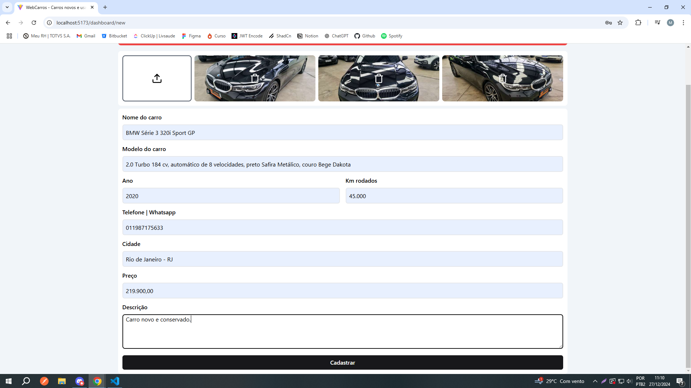

# Web Carros


O **Web Carros** é uma plataforma para compra e venda de veículos, que conecta compradores e anunciantes de forma ágil e eficiente. Desenvolvido com _React, Tailwind, e TypeScript_, o site utiliza o _Firebase Database_ para gerenciamento de dados. Atualmente, está em fase de planejamento para lançamento na Vercel.

## Sumário

1. [Visão Geral do Projeto](#visão-geral-do-projeto-funcionalidades-principais)
   - [Busca por Cidades](#1-destaque-de-veículos-anunciados)
   - [Dados Detalhados](#2-dados-detalhados)
2. [Tecnologias Utilizadas](#tecnologias-utilizadas-linguagens-e-ferramentas)
3. [Estrutura do Projeto](#estrutura-do-projeto)
5. [Screenshots](#screenshots)
   - [Iphone 14 pro max](#iphone-14-pro-max)
   - [Ipad pro](#ipad-pro)
   - [Mobile](#mobile)
   - [Desk](#desktop)
6. [Requisitos para Rodar o Projeto Localmente](#requisitos-para-rodar-o-projeto-localmente)
7. [Rodar o Projeto Localmente](#rodar-o-projeto-localmente)
8. [Autores](#autores)
9. [Licença](#licença)

## Visão Geral do Projeto (Funcionalidades Principais)

### 1. Destaque de veículos anunciados:

- Os usuários podem acessar os dados dos anúncios dos veículos pelo nome para obter informações e entrar em contato com o anunciante.

### 2. Dados Detalhados:

- **Imagens:** Exibe a condição do carro anunciado.
- **Modelo:** Mostra o Modelo do carro.
- **Configurações:** Informa as principais configurações do veículo.
- **Cidade:** Exibe a cidade no qual o anúncio se encontra.
- **KM:** Apresenta a quantidade de KM que se encontra o veículo.
- **Ano:** Indica o ano no qual o carro foi fabricado.
- **Descrição:** Mostra a descrição completa feita pelo anunciante em relação ao veículo.
- **Valor:** Exibe o valor do anúncio do carro.
- **Entrar em contato com o vendedor:** Funcionalidade para entrar em contato com o anunciante via whatsapp.

## Tecnologias Utilizadas (Linguagens e ferramentas)

<table>
    <tr>
      <td align="center">
        <a href="https://react.dev/">
          
          <br />
          <sub>
            <b>React</b>
          </sub>
        </a>
      </td>
      <td align="center">
        <a href="https://tailwindcss.com/">
          
          <br />
          <sub>
            <b>Tailwind CSS</b>
          </sub>
        </a>
      </td>
      <td align="center">
        <a href="https://www.typescriptlang.org/">
          
          <br />
          <sub>
            <b>TypeScript</b>
          </sub>
        </a>
      </td>
    </tr>
</table>
<table border-style="none">
  <tr>
      <td align="center">
        <a href="https://github.com/MarcioJorgeMelo/web-carros">
          
          <br />
          <sub>
            <b>Web Carros</b>
          </sub>
        </a>
      </td>
    <td align="center">
        <a href="https://firebase.google.com/">
          
          <br />
          <sub>
            <b>Firebase</b>
          </sub>
        </a>
      </td>
    <td align="center">
      <a href="https://git-scm.com/">
        <br />
        <sub>
          <b>Git</b>
        </sub>
      </a>
    </td>
    <td align="center">
      <a href="https://github.com/">
        
        <br />
        <sub margin-top="50px;">
          <b>Github</b>
        </sub>
      </a>
    </td>
  </tr>
</table>

## Estrutura do Projeto

O projeto é organizado em vários arquivos para melhor organização do código e separação de interesses:

- `public/`: A pasta serve como o local para armazenar arquivos estáticos que não passam pelo processo de build do React e podem ser acessados diretamente no navegador.
- `src/`: Onde encontra-se o processo de desenvolvimento de todo o código-fonte do sistema.
- `components/`: A pasta contém todos os componentes utilizados na aplicação.
- `context/`: Onde encontra-se o processo de desenvolvimento do context que engloba todo sistema.
- `pages/`: A pasta contém a estrutura das páginas da aplicação.
- `routes/`: Onde encontra-se o controle de autenticação das demais rotas do sistema.
- `services/`: A pasta contém as configurações para utilização das funções do Firebase.
- `shared/`: Onde encontra-se funcionalidades utilizadas em toda a aplicação.
- `App.jsx`: A pasta contém toda a estrutura de rotas do sistema.
- `index.css`: Onde encontra-se a estilização global da aplicação.

## Screenshots

### Iphone 14 pro max


### Ipad pro


### Mobile


### Desktop





## Requisitos para Rodar o Projeto Localmente

### Node.js e npm:

- Verifique se você tem o Node.js instalado. Caso contrário, faça o download e instale a versão mais recente do Node.js.
- O npm (Node Package Manager) é instalado automaticamente com o Node.js.

### Git:

- Certifique-se de ter o Git instalado em sua máquina. Se não tiver, você pode baixá-lo aqui.

### Editor de Texto ou IDE:

- Escolha um editor de texto ou uma IDE (Ambiente de Desenvolvimento Integrado) para trabalhar no código. Alguns exemplos populares incluem o Visual Studio Code, Sublime Text e Atom.

### Navegador Web:

- Você precisará de um navegador web para visualizar o aplicativo localmente. Recomendamos o uso do Google Chrome, Mozilla Firefox ou Microsoft Edge.

### Conta no Firebase Console no plano Blaze:

- O projeto Weatherio consome dados do storage, função paga por utilização, dos serviços do Firebase. Crie uma conta gratuita em OpenWeatherMap, cadastre seu cartão e obtenha uma chave de API (API key).

## Rodar o Projeto Localmente

**Clone o projeto**

```bash
  git clone https://github.com/MarcioJorgeMelo/web-carros.git
```

**Vá para a pasta do projeto**

```bash
  cd webcarros
```

**Abra o projeto no VSCode**

```bash
  code .
```

**Instale as dependências**

```bash
  npm install # Instala as dependências (se ainda não tiver feito)
```

**Abra com o React Server**

```bash
  npm run dev # Inicia o servidor React
```

## Autores

- [@MarcioJorgeMelo](https://github.com/MarcioJorgeMelo)

## Licença

- [MIT](https://choosealicense.com/licenses/mit/)
